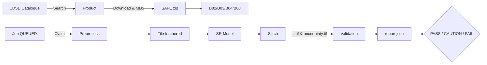

# 🛰️ SUBPIXEL-SENTRY
### *Tactical Land-Cover Intelligence with AI Validation*

[](https://www.python.org/)
[](https://fastapi.tiangolo.com/)
[](https://www.postgresql.org/)
[](https://playwright.dev/)

> **Trust, but verify the AI.** <br>
> SENTRY super-resolves Sentinel-2 imagery from 10 m to 2.5 m per pixel (bands B02, B03, B04, B08), then mathematically verifies whether the result is trustworthy **before anyone is allowed to use it**. Model-generated detail is never presented as new observation — the validation step is the point.

Built for the **Smart India Hackathon** problem statement SIH26142 (NTRO, Space Technology).

---

## 🎬 Action Demo
Here's a sped-up look at the SUBPIXEL-SENTRY console in action—from kicking off a job to inspecting the split-slider, metrics, and evidence dossier.

[](brag-output/brag.webm)

*(Click the GIF or [here](brag-output/brag.webm) to watch the full 1-minute UI walkthrough.)*

---

## 🚀 Run it (Windows, One Click)

Double-click **`Start-SENTRY.bat`**. It boots Postgres, the API, and the console, then opens the console in your browser. `Stop-SENTRY.bat` cleanly shuts the servers down.

| Service | Address |
|---|---|
| **Console** | http://127.0.0.1:8080/index.html?backend=http://127.0.0.1:8077 |
| **API + Docs** | http://127.0.0.1:8077/docs · health at `/v1/health` |
| **Postgres** | 127.0.0.1:54322 (`sentry-postgres` container) |

**💡 Tip:** Hard-refresh (`Ctrl+Shift+R`) so the latest console scripts load. If the page ever looks stale or points at the wrong backend, go to: **Connect… → Reset saved**.

<details>
<summary><strong>🔧 Manual Start (Any OS)</strong></summary>

```powershell
python -m venv .venv
.venv\Scripts\Activate.ps1
pip install -r requirements.txt
docker start sentry-postgres        # or: python scripts/db_init.py --recreate on empty DB
$env:DEV_AUTH="true"; $env:ARTIFACT_STORE="local"
python -m uvicorn backend.main:app --host 127.0.0.1 --port 8077
python -m http.server 8080          # different port from the API
python -m worker.main               # job worker (needs the DB)
```
</details>

---

## 💻 Using the Console

The top Run Bar walks you through four clickable steps:

1. 🔌 **Backend** — Where the API lives. Found automatically by scanning localhost; override with `?backend=` or in **Connect…**.
2. 👤 **Identity** — Who you are. On a dev backend, the console starts a **demo session automatically** (user + project, stored in your browser only).
3. 🗺️ **Scene + Model** — Pick a staged L2A scene and the reconstruction model.
4. ▶️ **Run** — Submits the job and streams progress, previews, and validation.

**Connect…** shows live status (backend/identity/project), a backend finder, one-click demo session, and manual UUID fields. No backend? Both Run buttons play an honestly-labeled simulator demo instead of failing.

### Viewport Modes
* **Split Slider**: Compare the original 10 m and the reconstructed 2.5 m resolution.
* **10m / 2.5m**: View full-screen single resolution.
* **3D Tactical DEM**: A Three.js Himalayan terrain model (`assets/terrain_diffuse/height/normal.jpg`) with relief, contour, auto-orbit, and photo/elevation controls, plus fly-to-sector. *(Pure visualization, never analysis).*

---

## ⚙️ How the Pipeline Works


*(Note: A `FAIL` status closes the run, preventing unverified data from reaching analysts).*

### Models & Validation
* **Models:** `bicubic_4x` (baseline), `custom_mf_sr` (multi-frame fusion, 1–8 frames), `opensr_ldsrs2` (ESA diffusion; needs weights + torch, else `MODEL_UNAVAILABLE`).
* **Job States:** `QUEUED` → `CLAIMED` → `PREPROCESSING` → `RECONSTRUCTING` → `UNCERTAINTY` → `VALIDATING` → `REPORTING` → `COMPLETED` (plus `FAILED`/`CANCELLED`). Claims carry a lease with heartbeat renewal; a reaper requeues stale claims.
* **Validation:** Checks georeferencing, PSNR/SSIM on valid pixels, SAM/ERGAS, scale-back observation consistency, and uncertainty calibration. Any missing evidence fails the run.

---

## 📡 HTTP API

All routes live under `/v1` (interactive docs at `/docs`).
**Auth:** `Authorization: Bearer <Supabase JWT>`, or `X-Dev-User: <uuid>` when the backend runs with `DEV_AUTH=true`.

| Group | Routes |
|---|---|
| **health** | `GET /v1/health` |
| **projects & aois** | `GET/POST /v1/projects` & `GET/POST /v1/aois` |
| **scenes** | `GET /v1/scenes/search` |
| **jobs** | `GET/POST /v1/jobs`, `GET /v1/jobs/{id}`, `POST /v1/jobs/{id}/cancel` |
| **validations & reports** | `POST/GET /v1/validations`, `GET /v1/validations/{id}`, `GET /v1/reports/{id}` |
| **artifacts** | `GET /v1/artifacts/{id}/content`, `POST …/signed-url` |
| **models & alerts** | `GET /v1/models`, `GET /v1/models/status`, `GET/POST /v1/alerts`, `POST /v1/alerts/{id}/status` |
| **copernicus & dev** | `POST /v1/copernicus/search`, `POST /v1/copernicus/ingest`, `POST /v1/dev/session` |

---

## 📁 Repository Layout & Data Sources

```
backend/            FastAPI control plane (routers, auth, queue, validation engine)
worker/             Claim-execute loop (preprocess, tiling, baselines, COG io)
supabase/           Versioned schema (0001..0014), RLS, seeds, alerts, & local shims
tests/              Pytest suite (hermetic fake_db; RLS self-skips)
scripts/            serve.py, db_init.py, smoke_e2e.py, fetchers, stage_real_scene.py
index.html / js/    Operator console (static, HTML/JS/CSS, 3D assets)
```

**Data sources:**
- **Sentinel-2** (Copernicus Data Space): Production input, L2A 10 m bands.
- **WorldStrat v1.1** (Zenodo 15382551): Reference data. SPOT HR imagery is **CC BY-NC 4.0** — outputs trained on it inherit the non-commercial term.
- **OpenSR LDSR-S2** (ESAOpenSR/opensr-model, pinned v1.1.1): Reference model. Fetch: `python scripts/fetch_opensr_weights.py`. See `SOURCES.md` for hashes/ledger.

---

## 🛠️ Testing & Configuration

**Configuration:** Rename/use `.env` for setup (e.g., `DEV_AUTH=true`, `ARTIFACT_STORE=local`). Database schema is found in `supabase/migrations/` and applied in order using `python scripts/db_init.py` or the Supabase CLI.

**Testing:**
```powershell
python scripts/compile_check.py   # byte-compile check (skips .venv)
python scripts/smoke_e2e.py       # full pipeline, no DB, no network
python -m pytest -q               # fast unit testing
```

---

## 🚨 Troubleshooting & Known Limitations

- **Page shows nothing / offline badge** — Run `Start-SENTRY.bat`, hard-refresh, or Connect… → Reset saved.
- **Demo session fails** — Needs Postgres (`docker start sentry-postgres`) and `DEV_AUTH=true` on the backend.
- **Scene list empty** — No scenes staged yet. Ingest via `POST /v1/copernicus/ingest` (needs CDSE credentials).
- **`MODEL_UNAVAILABLE`** — Fetch weights + install PyTorch, or fallback to `bicubic_4x` / `custom_mf_sr`.
- **Port 8000 busy** — SENTRY explicitly uses 8077/8080.
- **Limitations:** Uncertainty raster is a gradient-magnitude proxy; pixel inspector/evidence dossiers are simulator-backed for demo purposes; no Copernicus frame selector yet.
